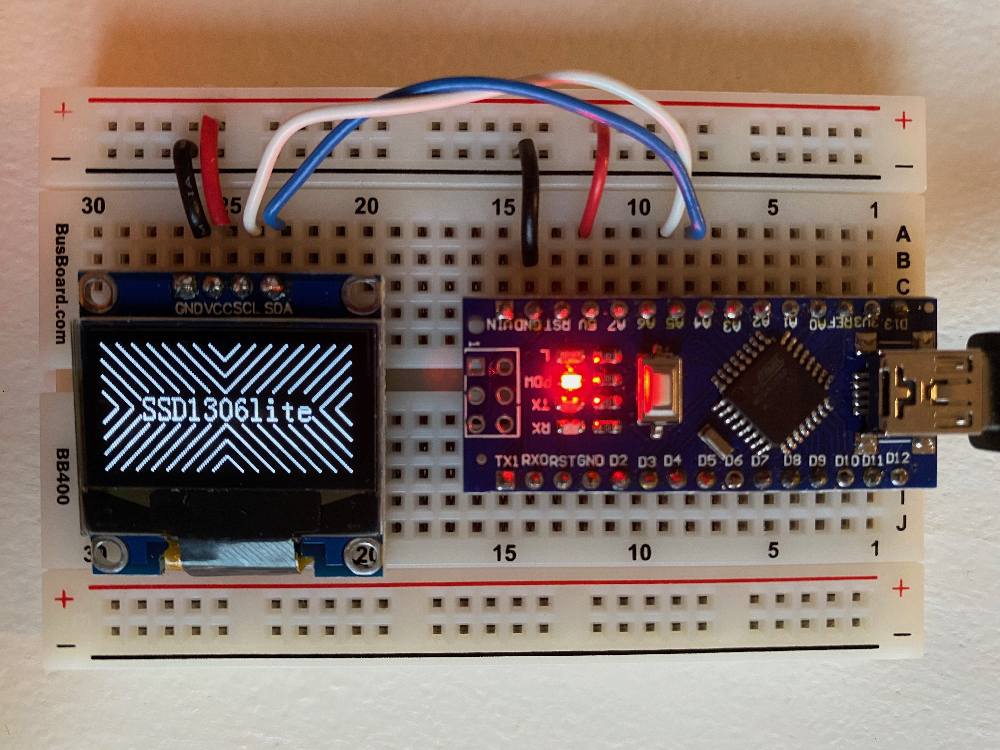
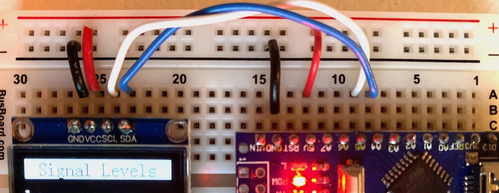
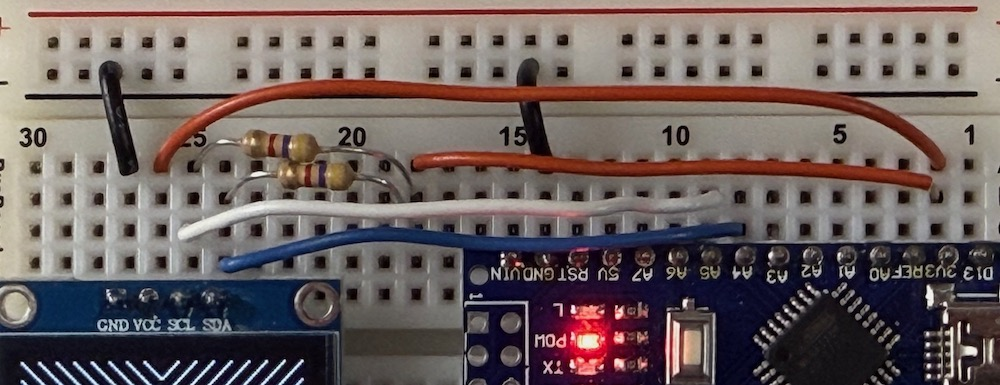
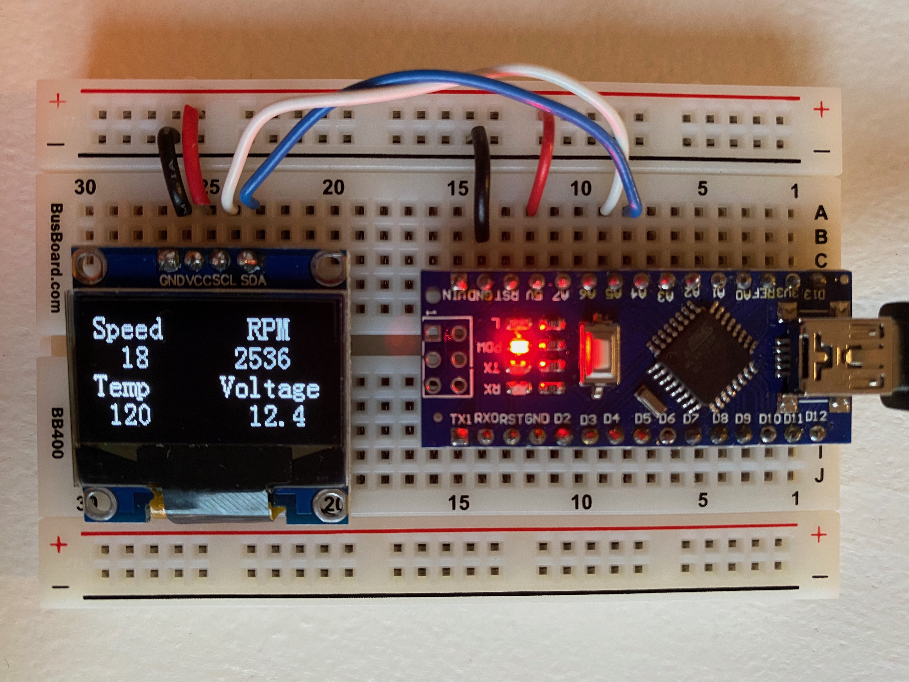
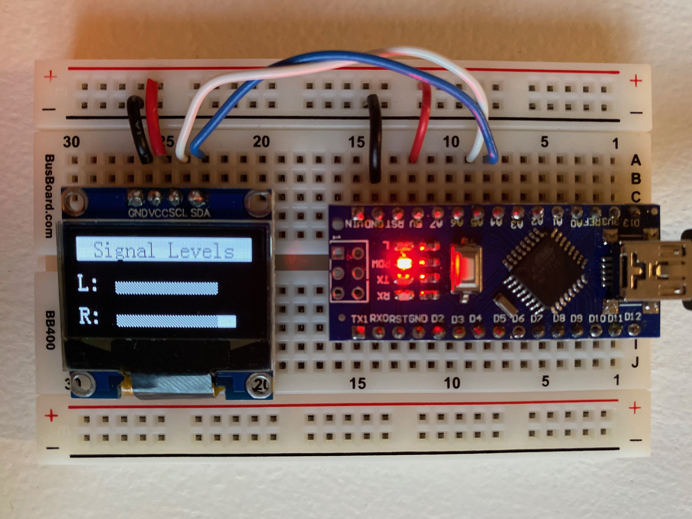
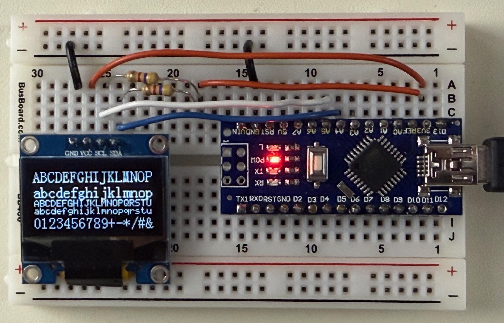
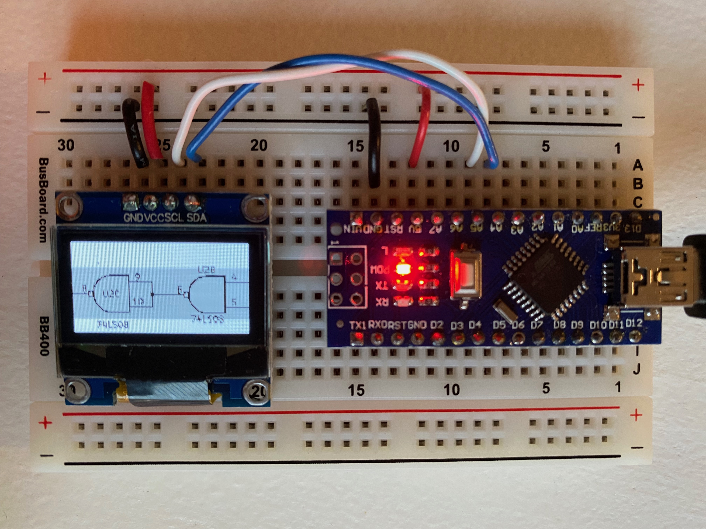
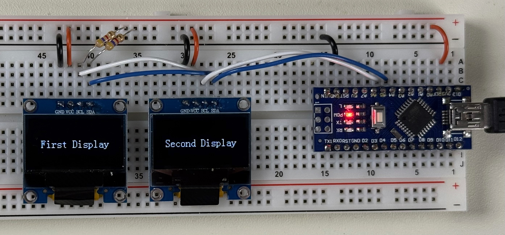

# SSD1306lite

SSD1306lite is a very lightweight Arduino hardware driver with text display methods for readily-available SSD1306-based I2C 128x64 OLED displays.



SSD1306lite works with 128x64 I2C OLED displays and supports text and very basic bitmap drawing.  It does not support scrolling or arbitrary drawing functions.  It uses minimal RAM and does not require any support libraries.  A hello world sketch only requires a few bytes of RAM.

This code does not use the Arduino Wire library and requires no buffer space.  The low-level I2C code is based on SSD1306xLED from the [ATtiny85 tinusaur project by Neven Boyanov](https://bitbucket.org/tinusaur/ssd1306xled), which was itself inspired by [IIC_wtihout_ACK](http://www.14blog.com/archives/1358).

## Features and limitations

Features:

* Text drawing with single and double-height fonts, 6x8 and 8x16
* Bitmap display from Arduino PROGMEM (EEPROM) storage
* Basic fill functions to draw some lines and shapes
* Extremely lightweight - no RAM buffer or external libraries required
* Supports dual displays

Limitations:

* Only supports SSD1306-based displays using i2C - no support for SPI displays
* All text and drawing is constrained to 8-bit boundaries in the vertical direction

This project was designed for applications that need only text and basic graphics while leaving most of the Arduino resources free for other code.

## Hardware connections

SSD1306 displays are native 3.3V devices, but many are advertised as being 5V compatible.  They seem to work fine using 5V for the _VCC_, _SCL_, and _SDA_ signals although this may shorten the life of the display.  Some displays will flicker if _VCC_ is right at or slightly above 5V.

SSD1306Lite supports two software modes to allow different wiring of the displays.  In both configurations, the display's _GND_ is connected to the Arduino's _GND_ pin and the _SCL_ and _SDA_ signals are connected the Arduino's _A5_ and _A4_ pins.

One of the two #defines below must be uncommented in the ssd1306lite.cpp file to support the different wiring options.

``` c++
// Uncomment one of the lines below to match the wiring.
#define WIRING_5V_DIRECT
//#define WIRING_3V_PULLUP
```

### WIRING_5V_DIRECT



This is the simplest mode to wire, but it may be harder on the display and may cause flickering.  The display's _VCC_ is connected to the Arduino's _5V_ pin and the Arduino drives the _SCL_ and _SDA_ pins to GND or +5V.

### WIRING_3V_PULLUP



A better configuration is to connect the display's _VCC_ to the Arduino's _3.3V_ pin. _SCL_ and _SDA_ are still connected to _A5_ and _A4_, but a 4.7K pullup resistor is added from _SCL_ to _3.3V_ and another from _SDA_ to _3.3V_.  In this configuration, the Arduino only drives the output pins to pull them low. For a high signal, the Arduino configures the pins as inputs and the external pullup resistors pull the tri-state signals to 3.3V.  The 3.3V configuration is a better match for the display and it is also more compatible with the I2C bus.

> [!WARNING]
> The physical wiring and the #define in ssd1306lite.cpp **MUST** match.  If WIRING_5V_DIRECT is compiled when pullup resistors are installed, then 5V can be connected on the _3.3V_ line and some components may be damaged.

## Demo sketch

A demo sketch is included to show off the features of the code.  Wire the SDA, SCL, and power pins to an Arduino.  Then open the src.ino file in the Arduino IDE to see a set of sample screens and animations.  This should run on an Uno or Nano with no code changes or configurations required.

This has been tested on the Arduino Uno and Nano using the default A4 and A5 ports for SDA and SCL.  It will work with other Arduinos as well, but the port definitions will need to be changed to match the hardware.  Instructions to do this are at the top of the ssd1306.cpp file.

## Using the code in a project

The code is not distributed as a library. Follow these steps To incorporate SSD1306lite into a project:

* Add the ssd1306lite cpp and h files to your project's directory along with the two font header files.  
* Include the main header file in your sketch file
* Declare an SSD1306Display object
* Initialize the display
* Call the needed display functions for your application

## Sample sketch

Below is the minimal hello world sketch

```C++
#include "ssd1306lite.h"

// Declare the global instance of the display
SSD1306Display display;

void setup() {
    // Initialize the display
    delay(50);
    display.initialize();

    // clear the screen and display text
    display.clear();
    display.text2x(0, 0, "Hello, world");
}

void loop() {
}
```

## Display coordinates

All of the calls use row and column addressing. There are eight rows, each containing eight vertical pixels (64 pixels total).  There are 128 one-pixel wide columns.

This matches the Display RAM in the SSD1306 controller.  Display RAM is changed by writing bytes to the controller, where each byte represents 8 vertical pixels.  The LSB of each byte is the top pixel in the row of eight.

This same format is used in the font and bitmap image files.  A set of 128 bytes writes 8 full lines of the display.  A set of 1024 bytes are needed to write all 64 lines.

The SSD1306lite text and fill methods write data immediately to the controller's Display RAM.  This allows the code to use very little memory because it has no local buffer.  

The downside to this approach is that it restricts text to defined rows with 8 pixels boundaries. A text character can be drawn on the eight display rows 0..7 or 8..15 or up to 56..63, but it cannot be drawn on 3..10, for example.

If arbitrary text placement or more advanced graphics are needed, a different code base should be used that supports a local graphics buffer in the Arduino RAM.

## Sample Images






## Dual Displays

SSD1306 displays can be configured to use one of two different I2C bus addresses.  The alternate address is usually set using a soldering iron to move a resistor on the address select pads of the display module.  SSD1306lite supports using either address, or even driving two different displays in the same project.  

To use two displays, they must be connected using the WIRING_3V_PULLUP method described above.



To use multiple displays, declare two SSD1306Display objects as shown in the code below.

```C++
SSD1306Display display1(SSD1306_ADDR1);
SSD1306Display display2(SSD1306_ADDR2);

void setup() {
    // Start up the display and clear the screen
    delay(50);
    display1.initialize();
    display1.clear();
    display1.text2x(3, 12, "First Display");

    display2.initialize();
    display2.clear();
    display2.text2x(3, 8, "Second Display");
}
```
